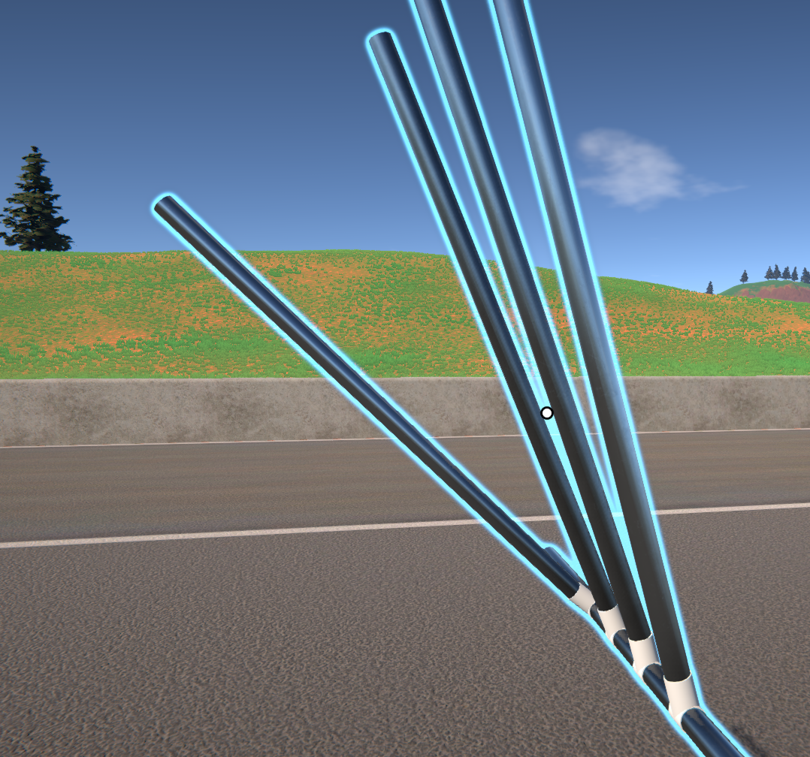

# Angled Parts in GearBlocks!
This is a GearBlocks mod that aims to add angled parts to the game. This gives the player more placement options without needing to node skip.\

## How to install
**Please refer to the GearLib documentation on how to setup BepInEx for your GearBlocks for modding.**

GearLib documentation here: https://github.com/KaBooMa/GearLib

Simply download the latest release and extract the AngledParts folder into your BepInEx/plugins folder.

## Credits
All models are maintained by alexrrr (Thank you Alex ❤️!)\
Thanks to SilverThorn for scaling models for importing in game!!